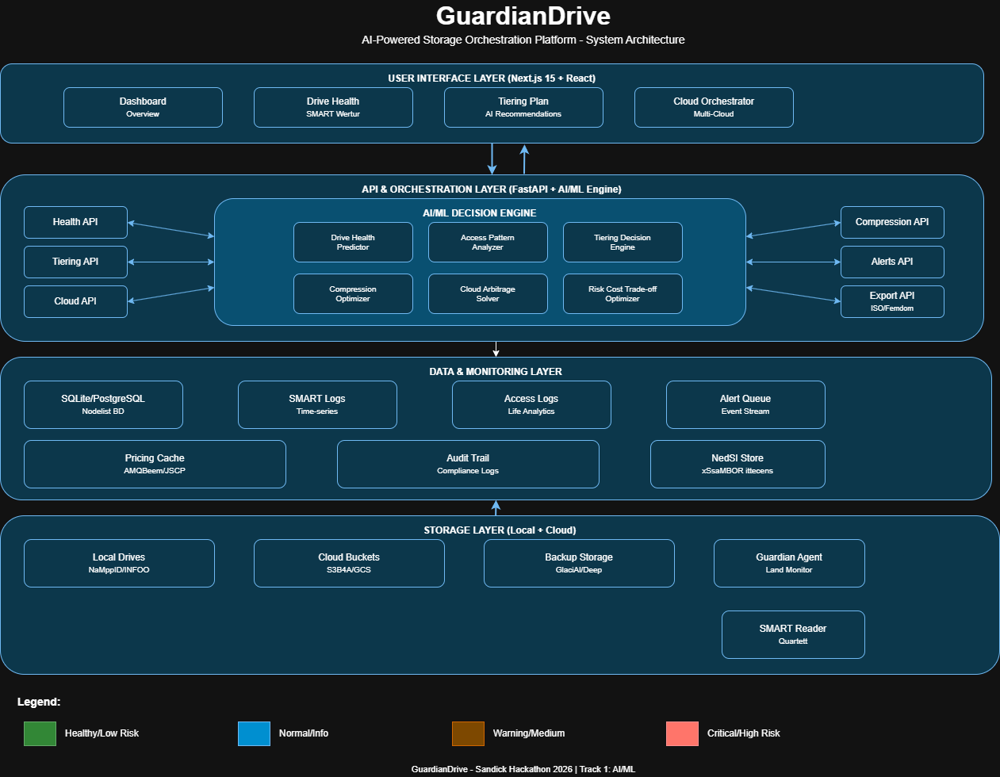
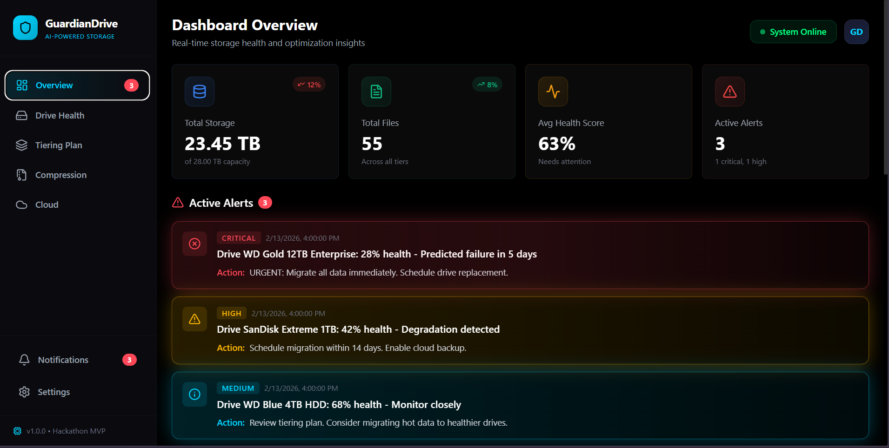
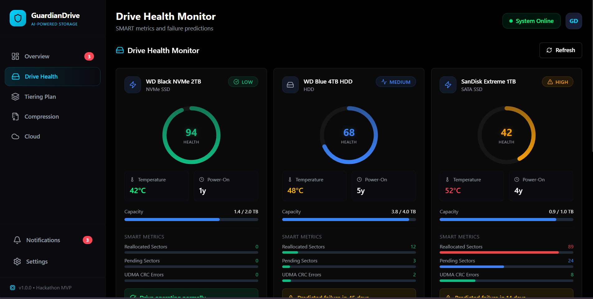
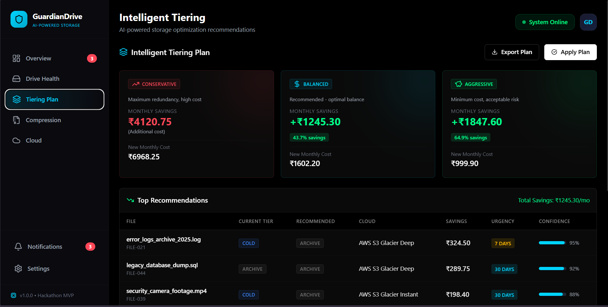
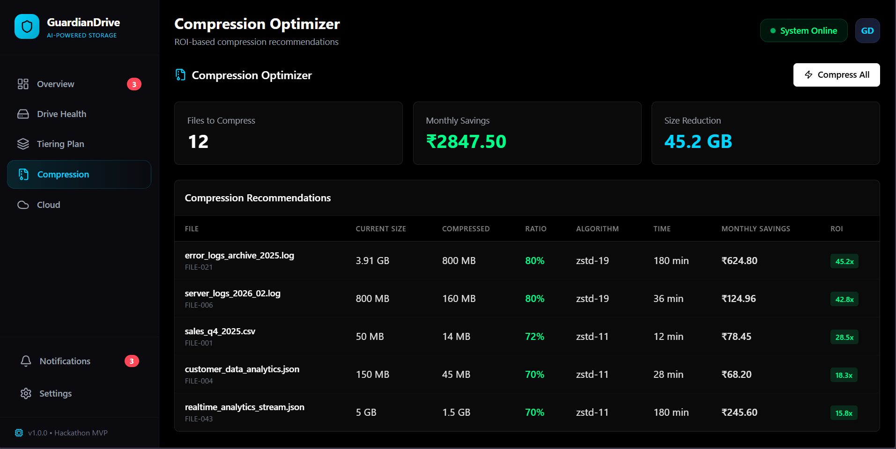
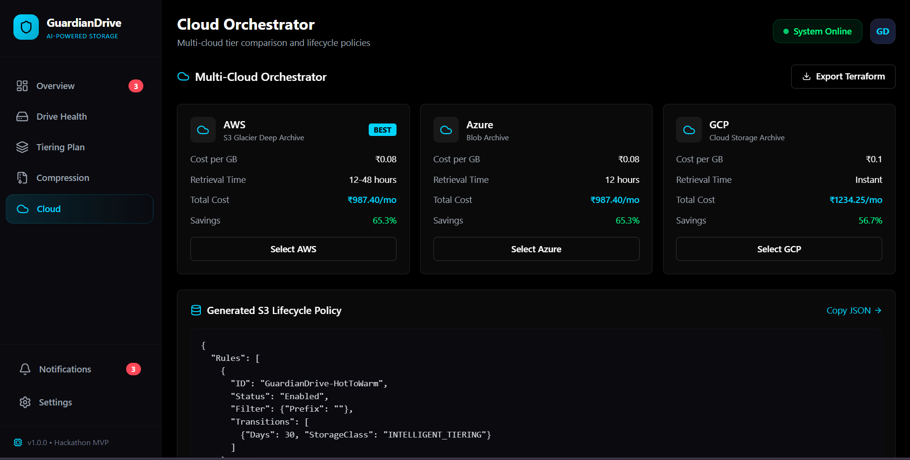

| | |
|---|---|
| **Project Name** | AI-Powered Storage Orchestration Platform |
| **Hackathon** | VIT-SanDisk Hackathon 2026 |
| **Organizer** | Vellore Institute of Technology |
| **Hackathon URL** | [Event Page](https://docs.google.com/forms/d/e/1FAIpQLSf6Bz2VlbPMQEIv7JnoRLNjM7lbjk2iluQy75jr5wpdRv9Gzg/viewform) |
| **Live Demo** | [View Dashboard](https://divyanshupatel.com/GuardianDrive-sandisk/) |
| **Team Lead** | Divyanshu Patel |

<br />

# GuardianDrive 🛡️

**AI-Native Storage Orchestration & Predictive Maintenance**



### MVP Screenshots

#### 1. Dashboard Overview


#### 2. Drive Health Monitor


#### 3. Intelligent Tiering Plan


#### 4. Compression Optimizer


#### 5. Multi-Cloud Orchestrator


---

## 🎯 Problem Statement
- **Silent Failures:** 87% of data loss occurs due to ignored SMART metrics.
- **Cost Inefficiency:** 40-60% of cloud budgets wasted on improper tiering.
- **Fragmented Management:** Lack of unified control for local and cloud storage.

## 💡 Solution
GuardianDrive unifies prediction, optimization, and orchestration:
1.  **Predictive Health:** XGBoost model predicts drive failures 5-45 days in advance using SMART data.
2.  **Intelligent Tiering:** Categorizes data (Hot/Warm/Cold) and automates movement to optimal tiers (Local NVMe vs S3 Glacier).
3.  **Cost Optimization:** Real-time multi-cloud arbitrage (AWS/Azure/GCP) to minimize storage bills.

## 🏗️ Architecture Stack
- **Frontend:** React (Vite) + TypeScript + Tailwind (Obsidian Dark Theme)
- **Backend:** FastAPI (Python) + AI Decision Engine (XGBoost/K-means)
- **Data:** Simulated Drive Array + SQLite + Cloud Pricing Cache
- **Hosting:** GitHub Pages (Frontend) + Mock Data Mode

## 🔧 Key Features
- **Drive Health Monitor:** Real-time circular gauges for risk and failure prediction.
- **ROI Compression:** Calculates exact savings before compressing files.
- **Cloud Arbitrage:** Auto-generates S3 Lifecycle policies and Terraform scripts.
- **Simulated Environment:** Full mock data engine demonstrating 5 drives and 55+ files.

## 🚀 Quick Start
```bash
# Frontend
cd frontend
npm install && npm run dev
# App: http://localhost:5173
```

## 📂 Project Structure
```
guardiandrive/
├── backend/          # FastAPI + AI Models
├── frontend/         # React + Dashboard components
└── docs/             # Architecture artifacts
```

---
*Built for VIT-SanDisk Hackathon 2026*
